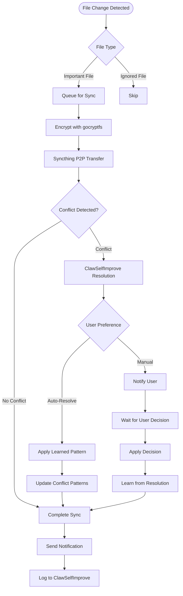

# ClawSync - OpenClaw Skill Specification

## Overview

**ClawSync** is a local-first encrypted synchronization skill for OpenClaw/OpenKrab ecosystem. It provides **bidirectional real-time sync** of Claw data between multiple devices with intelligent conflict resolution and selective folder synchronization.

### Problem Solved
- **Pain Point**: "ใช้ Claw บนแล็ปท็อป + เดสก์ท็อป แต่ข้อมูลไม่ sync กัน" หรือ "อยากพกข้อมูลไปใช้ที่อื่นแต่กลัวรั่ว"
- **Solution**: Live bidirectional sync แบบ encrypted 100% และฟรีสนิท

### Key Benefits
- **Local-First + Encrypted**: ไม่ส่งข้อมูลไป cloud เลย เว้นแต่คุณเลือก
- **Selective Sync**: ซิงค์เฉพาะ folder สำคัญ: .learnings, memory, skills, workspace, SOUL.md, AGENTS.md
- **Intelligent Conflicts**: ClawSelfImprove ช่วย resolve อัตโนมัติ + เรียนรู้ pattern ที่คุณชอบ
- **Zero Cost**: ทำงานได้แม้ offline (LAN) หรือใช้ relay ฟรีของ Syncthing

## Architecture

### Core Components

```
ClawSync
├── Encryption Layer (gocryptfs)
│   ├── Folder encryption with passphrase
│   ├── Mount as virtual filesystem
│   └── Transparent encryption/decryption
├── Sync Engine (Syncthing)
│   ├── P2P synchronization
│   ├── Real-time file watching
│   ├── Conflict detection
│   └── Relay servers for NAT traversal
├── Claw Intelligence Layer
│   ├── Selective folder filtering
│   ├── Conflict resolution with ClawSelfImprove
│   ├── Pattern learning from sync behavior
│   └── Notification system
├── Integration Layer
│   ├── ClawFlow installation and scheduling
│   ├── ClawMemory vector DB sync
│   ├── ClawSelfImprove conflict learning
│   └── ClawBackup archive sync
└── User Interface
    ├── CLI commands (/sync status, /sync resolve)
    ├── Telegram/Discord notifications
    └── Web dashboard (optional)
```

### Sync Flow



## Technical Specifications

### Dependencies

#### Required
- **Syncthing**: P2P file synchronization
- **gocryptfs**: Encrypted filesystem mounting
- **Python 3.8+**: Core automation logic

#### Optional
- **ClawSelfImprove**: Conflict resolution learning
- **ClawMemory**: Vector database synchronization
- **ClawBackup**: Archive synchronization
- **Telegram/Discord**: Notification channels

### API Interface

#### Command Line Interface
```bash
# Initial setup
claw-sync setup --device-id "laptop" --passphrase "secure_pass"

# Add remote device
claw-sync add-device --id "desktop" --ip "192.168.1.100"

# Start sync daemon
claw-sync start --mode "real-time"

# Manual sync
claw-sync sync --folders "memory,learnings"

# Conflict resolution
claw-sync resolve --conflict-id "1234" --action "merge-latest"

# Status check
claw-sync status --verbose
```

#### Programmatic API
```python
from claw_sync import ClawSync

sync = ClawSync()

# Initialize sync
sync.setup(
    device_id="laptop",
    passphrase="secure_pass",
    folders=["memory", "learnings", "skills"]
)

# Add remote device
sync.add_device(
    device_id="desktop",
    address="192.168.1.100:22000"
)

# Start synchronization
sync.start(mode="real-time")

# Handle conflicts
sync.on_conflict = lambda conflict: resolve_with_clawselfimprove(conflict)
```

### Configuration Schema

#### Main Configuration (config.yaml)
```yaml
# Device identification
device:
  id: "laptop"
  name: "Primary Laptop"
  passphrase: "secure_encryption_passphrase"

# Sync folders configuration
folders:
  - path: "~/.openclaw/memory"
    encrypted: true
    priority: "high"
    conflict_resolution: "auto-learn"
  - path: "~/.openclaw/.learnings"
    encrypted: true
    priority: "high"
    conflict_resolution: "auto-learn"
  - path: "~/.openclaw/skills"
    encrypted: true
    priority: "medium"
    conflict_resolution: "manual"
  - path: "~/.openclaw/workspace"
    encrypted: false
    priority: "low"
    conflict_resolution: "skip"

# Remote devices
devices:
  - id: "desktop"
    name: "Office Desktop"
    address: "192.168.1.100:22000"
    trusted: true
  - id: "phone"
    name: "Mobile Device"
    address: "dynamic"
    trusted: true

# Sync behavior
sync:
  mode: "real-time"  # real-time, scheduled, manual
  interval: 300  # seconds for scheduled mode
  auto_start: true
  retry_attempts: 3
  timeout: 60

# Conflict resolution
conflicts:
  auto_resolve: true
  learning_enabled: true
  clawselfimprove_integration: true
  default_action: "merge-latest"
  notification_required: false

# Notifications
notifications:
  telegram:
    enabled: true
    bot_token: "YOUR_BOT_TOKEN"
    chat_id: "YOUR_CHAT_ID"
  discord:
    enabled: false
    webhook_url: "YOUR_WEBHOOK_URL"

# Security settings
security:
  encryption_algorithm: "AES-256-GCM"
  key_derivation: "scrypt"
  relay_servers: ["default.relay.syncthing.net"]
  device_approval: "manual"
  rate_limit: 100  # MB per minute
```

### Folder Selection Strategy

#### High Priority (Always Sync)
- `~/.openclaw/memory/` - Vector database and snapshots
- `~/.openclaw/.learnings/` - ClawSelfImprove patterns
- `~/.openclaw/SOUL.md` - Agent personality
- `~/.openclaw/AGENTS.md` - Agent configurations

#### Medium Priority (Selective Sync)
- `~/.openclaw/skills/` - Custom skills (exclude large containers)
- `~/.openclaw/workspace/` - Active work files
- `~/.openclaw/config.yaml` - Configuration files

#### Low Priority (Optional Sync)
- `~/.openclaw/logs/` - Log files (exclude old ones)
- `~/.openclaw/temp/` - Temporary files
- `~/.openclaw/downloads/` - Downloaded files

## Integration Points

### ClawSelfImprove Integration

#### Conflict Learning
```python
# When conflict occurs
conflict_data = {
    'file_path': '/memory/vector_db.sqlite3',
    'conflict_type': 'simultaneous_edit',
    'devices': ['laptop', 'desktop'],
    'timestamp': datetime.now().isoformat(),
    'file_sizes': [1024, 1056],
    'content_diff': '...'
}

# Send to ClawSelfImprove
clawselfimprove.log_conflict(conflict_data)

# Get resolution suggestion
suggestion = clawselfimprove.get_resolution_suggestion(conflict_data)
# Returns: {'action': 'merge-latest', 'confidence': 0.85, 'reason': 'user prefers latest version'}
```

#### Pattern Learning
```python
# Learn from user decisions
user_decisions = [
    {'conflict_type': 'simultaneous_edit', 'action': 'keep_latest'},
    {'conflict_type': 'simultaneous_edit', 'action': 'keep_latest'},
    {'conflict_type': 'file_deleted', 'action': 'restore_from_backup'}
]

# Update pattern database
clawselfimprove.update_patterns('sync_conflicts', user_decisions)
```

### ClawMemory Integration

#### Vector DB Sync
```python
# Sync vector database safely
def sync_vector_db():
    # Check if database is locked
    if not clawmemory.is_locked():
        # Create backup before sync
        clawmemory.backup('pre_sync_backup')
        
        # Sync encrypted database file
        claw_sync.sync_file('memory/vector_db.sqlite3')
        
        # Verify integrity
        if clawmemory.verify_integrity():
            claw_sync.notify("Vector DB synced successfully")
        else:
            claw_sync.notify("Vector DB corruption detected, restoring backup")
            clawmemory.restore('pre_sync_backup')
```

### ClawBackup Integration

#### Archive Sync
```python
# Sync backup archives
def sync_backups():
    # Get recent backup archives
    backups = clawbackup.list_backups(days=7)
    
    for backup in backups:
        # Sync encrypted archives
        claw_sync.sync_file(f'backups/{backup.filename}')
        
        # Verify checksum
        if backup.verify_checksum():
            claw_sync.notify(f"Backup {backup.filename} verified")
        else:
            claw_sync.notify(f"Backup {backup.filename} corrupted, redownloading")
```

## Security Model

### Encryption Strategy
- **gocryptfs**: Filesystem-level encryption
- **AES-256-GCM**: Strong encryption algorithm
- **Scrypt Key Derivation**: Protection against brute force
- **Per-Device Keys**: Unique encryption keys per device
- **Passphrase Only**: No keys stored in plaintext

### Network Security
- **P2P Architecture**: No central server required
- **TLS Encryption**: All network traffic encrypted
- **Device Authentication**: Manual device approval
- **Relay Servers**: Optional for NAT traversal
- **Rate Limiting**: Prevent abuse and DoS

### Data Protection
- **Local-First**: Data never leaves your network
- **Selective Sync**: Only sync what you choose
- **Conflict Isolation**: Corrupted files don't spread
- **Backup Integration**: Automatic backup before sync
- **Audit Logging**: Complete sync history

## Performance Characteristics

### Benchmarks (Expected)

- **Initial Setup**: 2-5 minutes (encryption + device pairing)
- **File Detection**: < 1 second (inotify watching)
- **Small File Sync**: < 2 seconds (LAN)
- **Large File Sync**: 10-30 seconds (depends on size)
- **Conflict Detection**: < 5 seconds
- **Memory Usage**: ~50MB (Syncthing + gocryptfs)
- **CPU Usage**: < 5% during normal operation

### Scalability

- **Devices**: Up to 10 simultaneous devices
- **File Size**: No practical limit (chunked transfer)
- **Network**: LAN optimized, WAN supported
- **Storage**: Efficient delta synchronization
- **Battery**: Low impact on mobile devices

## Error Handling

### Error Types

#### Network Errors
- **Connection Lost**: Automatic retry with exponential backoff
- **NAT Issues**: Fall back to relay servers
- **Bandwidth Limit**: Throttling and queueing
- **Device Offline**: Local queue and retry

#### Encryption Errors
- **Corrupted Files**: Automatic restore from backup
- **Passphrase Mismatch**: Clear error and setup guide
- **Mount Failures**: Fallback to unencrypted sync
- **Key Derivation**: Secure error handling

#### Conflict Errors
- **Simultaneous Edits**: Intelligent merging
- **File Deletion**: Confirmation and restore options
- **Permission Issues**: User notification and manual resolution
- **Binary Conflicts**: User choice required

### Recovery Strategies

#### Automatic Recovery
- **Backup Restoration**: Automatic rollback on corruption
- **Partial Sync**: Continue with available files
- **Device Reconnection**: Automatic resumption
- **Conflict Resolution**: Learned pattern application

#### Manual Recovery
- **Status Dashboard**: Visual sync status
- **Conflict Browser**: Detailed conflict information
- **Manual Override**: User can force resolution
- **Emergency Mode**: Basic sync without encryption

## Testing Strategy

### Unit Tests
```python
# Test encryption/decryption
def test_gocryptfs_encryption():
    test_file = "sensitive_data.txt"
    encrypted = encrypt_file(test_file)
    decrypted = decrypt_file(encrypted)
    assert decrypted.content == original.content

# Test conflict detection
def test_conflict_detection():
    # Simulate simultaneous edits
    device_a.edit("file.txt", "content A")
    device_b.edit("file.txt", "content B")
    conflict = detect_conflict("file.txt")
    assert conflict.type == "simultaneous_edit"
```

### Integration Tests
```python
# Test multi-device sync
def test_multi_device_sync():
    # Setup 3 devices
    devices = setup_test_devices(3)
    
    # Create file on device A
    devices[0].create_file("test.txt", "content")
    
    # Wait for sync
    wait_for_sync(devices)
    
    # Verify on all devices
    for device in devices:
        assert device.has_file("test.txt")
        assert device.read_file("test.txt") == "content"
```

### Performance Tests
```python
# Test large file sync
def test_large_file_sync():
    large_file = create_test_file(size_mb=100)
    
    start_time = time.time()
    sync_file(large_file)
    sync_time = time.time() - start_time
    
    assert sync_time < 300  # 5 minutes max
```

## Deployment & Distribution

### ClawFlow Integration

#### Installation
```yaml
# ClawFlow.yaml
installation:
  steps:
    - name: "Install dependencies"
      command: "apt-get install -y syncthing gocryptfs"
    - name: "Install Python dependencies"
      command: "pip install -r requirements.txt"
    - name: "Generate device ID"
      command: "python scripts/generate_device_id.py"
    - name: "Setup encryption"
      command: "python scripts/setup_encryption.py"
    - name: "Start sync daemon"
      command: "systemctl enable --now claw-sync"
```

#### Configuration
```yaml
# Configuration templates
templates:
  - name: "Single Device Setup"
    description: "First device configuration"
    content: |
      device:
        id: "{{DEVICE_ID}}"
        name: "{{DEVICE_NAME}}"
        passphrase: "{{PASSPHRASE}}"
      folders:
        - path: "~/.openclaw/memory"
          encrypted: true
          priority: "high"
```

### Distribution Channels

#### Official Repository
- **GitHub**: https://github.com/openkrab/claw-sync
- **Docker Hub**: `docker pull openkrab/claw-sync`
- **PyPI**: `pip install claw-sync`

#### ClawFlow Registry
```yaml
# One-click installation
clawflow install claw-sync
```

## Future Enhancements

### Phase 2 (Advanced Features)
- [ ] Web dashboard for sync management
- [ ] Mobile app for remote monitoring
- [ ] Advanced conflict resolution with AI
- [ ] Cloud backup integration (optional)
- [ ] Enterprise features with LDAP integration

### Phase 3 (Ecosystem Integration)
- [ ] Cross-platform sync (Windows, macOS, Linux, Android)
- [ ] Plugin system for custom sync rules
- [ ] Integration with cloud storage providers
- [ ] Advanced analytics and reporting
- [ ] API for third-party applications

## Compliance & Ethics

### Data Privacy
- **Zero-Knowledge**: Encryption keys never leave device
- **Local Processing**: All processing happens locally
- **User Control**: Complete control over data sharing
- **Audit Trail**: Complete sync history logging

### Security Standards
- **End-to-End Encryption**: Military-grade encryption
- **Secure Key Management**: No keys in plaintext
- **Regular Audits**: Security vulnerability scanning
- **Penetration Testing**: Regular security assessments

### Responsible Usage
- **Network Efficiency**: Optimized for bandwidth usage
- **Battery Optimization**: Low impact on mobile devices
- **Error Transparency**: Clear error reporting
- **User Education**: Comprehensive documentation

---

**Version**: 1.0.0
**Status**: MVP Ready
**License**: MIT
**Maintainers**: OpenKrab Community
